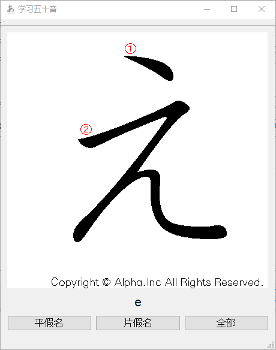

# kanacado

 卡片学假名

## 编译

kana是图片文件夹，编译时可能要放在D盘下（或修改代码里的路径）

在Windows 10 + Qt 5.9 + Mingw 5.3下编译通过

## 使用

点击“平假名”按钮，显示一个平假名，再点击一次显示其罗马音

另外两个按钮同理

## 参考资料

五十音图片来源：http://www.kkjn.jp/page-6/page-0-2

罗马音来源：http://www.age.ne.jp/x/nrs/iso3602/iso3602.html

如有错误欢迎指正！

